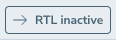
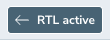

# storybook-addon-dir

A simple addon for a storybook rtl-toggle

## getting started
First install the dependencies
```bash
npm install -D storybook-addon-dir
```
```bash
yarn add -D storybook-addon-dir
```
```bash
pnpm add -D storybook-addon-dir
```

Then add the addon to your main.(js|ts) storybook file
```ts
// main.ts
const config: StorybookConfig = {
  addons: [
    'storybook-addon-dir',
    ...
  ],
  ...
}

export default config
```

## examples
The addon adds a button to the tool bar, at the top:



